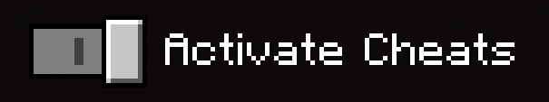
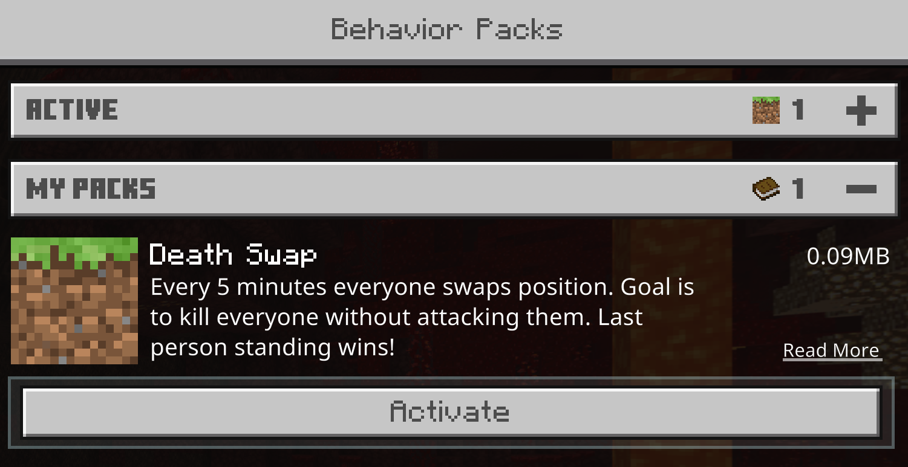

# Death Swap - Minecraft Bedrock Edition

Custom Minecraft gamemode where every 5 minutes you swap positions with your opponent(s). Your goal is to make everybody die without attacking them - last person standing wins!

## Inspiration

I wanted to play this gamemode with my friends after watching Dream and GeorgeNotFound play it. Watch them play their version of this mod here:

[Minecraft Death Swap](https://www.youtube.com/watch?v=vXS1pXWslxs)

[Minecraft Death Swap 2](https://www.youtube.com/watch?v=KjRfXURKAx8)

## Instructions

### Choose Minecraft version (Java or Bedrock)

- Minecraft: Bedrock Edition
  - You're in the right place!
- Minecraft: Java Edition
  - _Coming Soon..._

### Installation

1. Download the [latest version of the pack](https://github.com/goddtriffin/DeathSwap/releases)
2. Open Minecraft: Bedrock Edition
3. Double click the pack to install it

### Create a Death Swap world

1. Create a new world and call it whatever you want
2. In the `Experiments` section, toggle `Additional Modding Capabilities`

3. In the `Cheats` section, toggle `Activate Cheats`

4. In the `Behaviour Pack` selector, activate `Death Swap`

5. In the `Resource Pack` selector, toggle `Require players to accept resource packs to join`

## F.A.Q.

- What devices/consoles can play Death Swap?
  - Death Swap only works on `Minecraft: Bedrock Edition for Windows 10`. You will **NOT** be able to play this custom gamemode on your `Android`, `iPhone/iPad`, `XBox`, `Playstation`, `Nintendo Switch`, `Amazon Fire/Fire Phone`, or `Amazon Fire TV`. This is not a limitation of the mod nor a limitation of me, the sole developer, but a limitation of all mods that utilize JavaScript scripts. JavaScript is necessary to make this custom gamemode possible, so until `Microsoft` decides to allow it on every device/console there is nothing that I can do. Sorry!

## Development

### Pre-reqs

You must have this software installed in order to develop this pack.

- [Git](https://git-scm.com/)
- [Node.js](https://nodejs.org/)
- [NPM](https://www.npmjs.com/)
- [GNU Make](https://www.gnu.org/software/make/)

### Usage

Run `make` to see usage.

### Tools

- [GNU Make](https://www.gnu.org/software/make/) - Automates common developer tasks.
- [Webpack](https://webpack.js.org/) - Separates my code into distinct modules, and then bundles them all back together into the server.js and client.js scripts.
- [TypeScript](https://www.typescriptlang.org/) - Superset of JavaScript that ensures every piece of code is strictly typed ensuring safer, less buggy code and generally faster development speeds.
- [Gulp.js](https://gulpjs.com/) - Automates the more involved sub-tasks that need to get done like hot-reloading the behavior/resource packs every time a file is saved, generating the production-ready .mcaddon file, etc.
- [ESLint](https://eslint.org/) - Combined with the [Typescript Plugin](https://github.com/typescript-eslint/typescript-eslint), analyzes the code to find problems.
- [Prettier](https://prettier.io/) - Auto-formats the code to look identical no matter who writes it nor from where.
